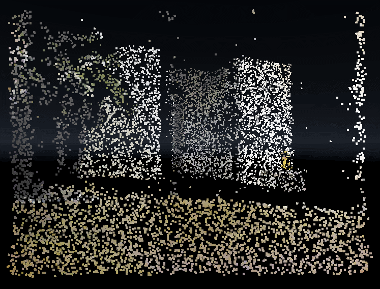

# Orbbec Unity Sample

## Prerequisites
* Windows machine
* Orbbec Astra
* Unity 2019.2.9f1 (could work for others, but only tested with this)
* Visual Studio 2019 (could work for others, but only tested with this)

## Features
* Depth stream visualiser
* Colour stream visualiser
* Body tracking (joints only). If you stand far back enough, spheres will appear representing joints
* VFX Graph example using both depth and colour

## Known issues
* Free body tracking will only work until March 21 2020
* If you have your own licence, add it in AstraController.cs
* Colour and depth streams are misaligned, currently Orbbec SDK's depth registration does not help much
* ColourToTexture and DepthToTexture implementations could be improved. Currently data type mismatches and lack of read/writable option for RenderTextures created in the UI makes the implementation sub-optimal.

## Credits
Astra SDK dotnet wrapper

https://github.com/bibigone/AstraDotNetDemo
